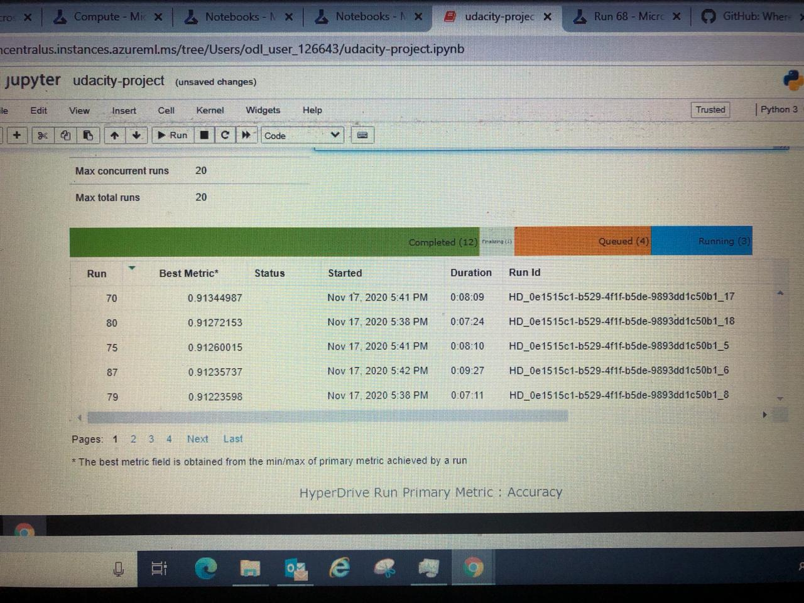

# Optimizing an ML Pipeline in Azure

## Overview

This project is part of the Udacity Azure ML Nanodegree.
In this project, we build and optimize an Azure ML pipeline using the Python SDK and a provided Scikit-learn model.
This model is then compared to an Azure AutoML run. In this project, we have tested the working of both Python SDK and Azure AutoML. 
The Azure SDK for Python is composed solely of over 180 individual Python libraries that relate to specific Azure services.
On the other Hand Azure AutoML is a no code solution which employ Azure's built-in capabilities for common machine learning tasks like 
classification, regression, and time-series forecasting

## Summary

**Problem:**

We were given a dataset of Bank Marketing with primary task of binary classification. We have to clean and transform the dataset 
and employ both Python SDK and AutoML on it. The dataset provided had class imbalance as well and no missing values.

**Solution:**

We have used in dataset on Python SDK and Azure AutoML. On Python SDK we used Logistic Regression with Choice on Hyper Params.
While on AutoML run, we have a greater choice of models. Logistic Regression had an accuracy of 0.91344 on Python SDK via HyperDrive
and best performing model was VotingEnsemble with accuracy of 0.9172 on Azure AutoMl run.

## Scikit-learn Pipeline

The pipeline consist of compute target created in Azure. a pyhton script (train.py for our case), Logistic Regression as the classification algorithm and inverse regulaization and mat_iteratons as hyper paramters

2 paramters were used here, Inverse of regularization strength '--C' and 'max_iters'
'--C' is a trade of paramter of logistic regression and is used to apply penalty on magnitude of paramters to reduce overfitting higher values of C correspond to less regularizationand wise versa and 'max_iters' is the number of iterations model will take to converge to a minima. We have employed RandomSampling as our paramter sampling because the biggest benefit of RandomSampling is it choose hyperparamters randmoly thus reducing the computational time and complexity. Other options we had were Grid sampling and Bayesian sampling both of them had their own importance like Grid sampling confines the search within a given set of paramters while Bayesian sampling select the next set of hyperparameters based on how the previous hyperparams performed. For Extensive search we can employ RandomSampling as a starting point and then using those hyperparameters do a Grid or Bayesian sampling as per our understanding of the problem and time.

Early stopping policy used here is BanditPolicy, its biggest benifit is that this policy terminates any runs early where the primary metric (accuray in our case) is not within the selected/pre-defined slack factor with respect to the best performing training run.

## AutoML

AutoML generated around 25 models for us with 4 cross validations and 4 model out of 25 outperform the Logistic Regression model from Scikit-learn pipeline. The best performing model was VotingEnsemble with accuracy of 0.9172. VotingEnsemble works by combining the predictions from several models. This enable a combine mechanism that improve model performance and achieving better performance than any single model would.
Hyperparameters generated were 'min_samples_leaf' ,  'min_samples_leaf' and 'n_estimators'. Since our dataset is imbalanced we can use a different metrics than accurcay here like AUC and ROC_AUC_Score.

## Pipeline comparison

The biggest advantage AutoML has over Python SDk HyperDrive is that we dont need to code much and with a little efforts we have a variety of models ready with given performance metrics alongside doing the data drep tasks as well. On the contrary Python SDK Pipeline provide us with more customization in hyper paramters, data preperation and model selection while the amount of coding required here is time consuming but in some cases where advance feature engineering is required Scikit-learn pipeline can play a vital role. Another Solution would be first using AutoML to find the model comparision and then using Scikit learn pipeline with hyperdrive to further tune the model.
Here model from both pipeline performed almost equally with a slightly better results from AutoML run by VotingEnsemble model (also by LGBM) in comparision with Logistic Regression from Python SDK hyperdrive.

## Future work

Apart from checking high cardinality, checking for missing values and  class imbalance. I would like to see re-sampling techniques be added in AutoML to further improve model biases toward majority classes due to few data points/observation in minority classes. This will further strenghten the Fair AI policy also.
